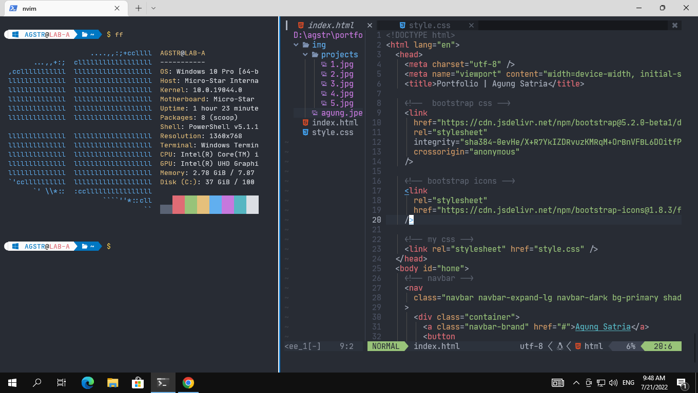

# Scr



# Post Install

```sh
serahlah
```

# xsetfast

```sh
Win + r : type "control keyboard"
Set repeat delay to short
To make it like 'xset r rate 300 50' ✌
```

# Install Windows Terminal from Microsoft Store (or just use powershell)

```sh
Open terminal (powershell) - Install Scoop (package Manager)
Set-ExecutionPolicy RemoteSigned -Scope CurrentUser # Optional: Needed to run a remote script the first time
irm get.scoop.sh | iex # read https://scoop.sh/
scoop install neovim nodejs git winfetch python
cd C:\Users\<yourUserName>
git clone https://github.com/agung-satria/win-dotfiles.git
rename win-dotfiles > .dotfiles
```

# Install oh my posh:

```sh
scoop install https://github.com/JanDeDobbeleer/oh-my-posh/releases/latest/download/oh-my-posh.json

$profile (to check the directory)
mkdir C:\Users\<yourUserName>\Documents\WindowsPowerShell (change the username to yours)
notepad $profile (file is in repo, copy it)
Or just copy "WindowsPowerShell" directory to "C:\Users\<yourUserName>\Documents\"

Install Nerd Font and change windows terminal to nerd font (ex: jetBrains Nerd Font)
Restart Windows Terminal / PowerShell
```

# Install VimPlug

```sh
iwr -useb https://raw.githubusercontent.com/junegunn/vim-plug/master/plug.vim |`
    ni "$(@($env:XDG_DATA_HOME, $env:LOCALAPPDATA)[$null -eq $env:XDG_DATA_HOME])/nvim-data/site/autoload/plug.vim" -Force
```

# Install Nvim

pip install pynvim --upgrade
cd C:\Users\<yourUserName>\.config
git clone https://github.com/agung-satria/nvim.git
rm -rf C:\Users\<yourUserName>\.config\nvim\autoload\plugged\*
Copy-Item -R C:\Users\<yourUserName>\.config\nvim\ -Destination C:\Users\<yourUserName>\AppData\Local\
nvim
PlugInstall (ikuti instruksi di nvim repo)\
:CocInstall coc-html coc-css coc-json coc-tsserver coc-phpls
:CocInstall coc-webview coc-markdown-preview-enhanced
Done!

# Disable ctrl-v

because ctrl-v is conflict with paste in windows terminal, which in vim it uses for visual block mode

```sh
Open Settings (ctrl-,)
Navigate to action
Search for copy and paste text
Change it to Ctrl+Shift+{c,p} or something
Then delete the default keybinding (ctrl-{c,v})
Save

```

> **_VIM NOTE:_** File config nvim di (.config). File terbaca di AppData\Local.
